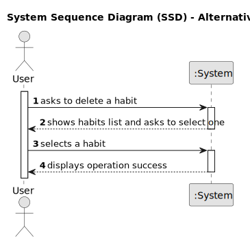

# US002 - Delete a Habit

## 1. Requirements Engineering

### 1.1. User Story Description

As a user, I want to delete habits.

### 1.3. Acceptance Criteria

* **AC1:** 

### 1.4. Found out Dependencies

* There is a dependency on "US001 - Create a habit" as there must be a habit to delete it.

### 1.5 Input and Output Data

**Input Data:**

* Selected data:
    * a habit
    

**Output Data:**

* (In)Success of the operation

### 1.6 System Sequence Diagram
