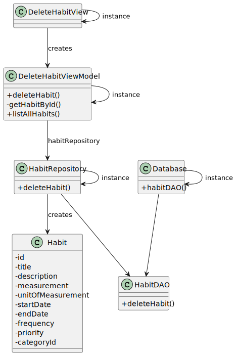

# US002 - Delete a Habit

## 3. Design - User Story Realization

## 3.1. Sequence Diagram (SD)

_**Note that SSD - Alternative One is adopted.**_

### Full Diagram

This diagram shows the full sequence of interactions between the classes involved in the realization of this user story.

## 3.2. Class Diagram (CD)

