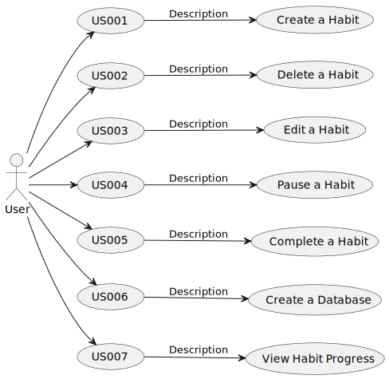

# Use Case Diagram (UCD)

# Use Cases / User Stories

| UC/US | Description                            |                   
|:------|:---------------------------------------|
| US001 | [Create a Habit](US001/readme.md)      |
| US002 | [Delete a Habit](US002/readme.md)      |
| US003 | [Edit a Habit](US003/readme.md)        |
| US004 | [Pause a Habit](US004/readme.md)       |
| US005 | [Complete a Habit](US005/readme.md)    |
| US006 | [Create a Database](US006/readme.md)   |
| US007 | [View Habit Progress](US007/readme.md) |
| US008 | [Home Page](US008/readme.md)           |
| US009 | [Navigation](US009/readme.md)          |
| US010 | [Weather API](US010/readme.md)         |